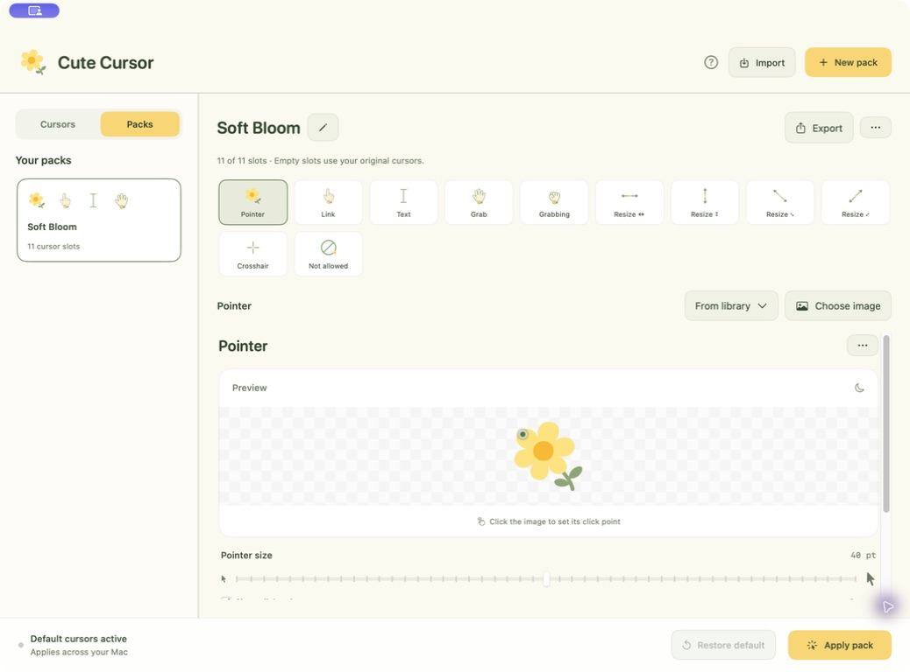

<p align="center">
  
</p>
<h1 align="center">Cute Cursor</h1>
<p align="center">A little flower for your everyday clicks.</p>
<p align="center">Native macOS app · Custom cursor packs · MIT licensed</p>

Cute Cursor lets you turn images into cursors and build a matching set for your Mac.
It includes **20 individual cursor designs** and **Soft Bloom**, a yellow-and-sage flower pack with 11 cursor roles,
each starting at **40 pt**. New image imports also start at 40.
The collection includes flowers, food, a rocket, a guitar, and more;
see the [complete cursor collection](docs/CURSOR_COLLECTION.md).

**[Download the Mac beta](https://github.com/vigneshkae/cute-cursor/releases/tag/v0.2.0-beta.1)** —
version 0.2.0 (4), Developer ID signed and notarized by Apple. One universal DMG
supports Apple Silicon and Intel Macs, targeting macOS 14 or newer. Open the DMG,
drag Cute Cursor to Applications, and open it there. A ZIP and SHA-256 checksums
are also included. See the compatibility notes below for hardware testing limits.

**Windows remains an unsigned preview.** The
[earlier test release](https://github.com/vigneshkae/cute-cursor/releases/tag/private-test-2026-09-23.1)
has a Windows x64 ZIP for Intel/AMD PCs and an ARM64 ZIP for Windows ARM devices.
Extract the matching ZIP and run `CuteCursor.exe`; the runtime is included.
Those Windows downloads are not covered by Apple's Mac notarization. Use the
new Mac beta above instead of the older unnotarized Mac development downloads.

Closing the window keeps custom cursors active; Quit / ⌘Q / Exit restores your originals.

The Mac source remains on this branch. The Windows implementation and setup guide
are on [codex/windows](https://github.com/vigneshkae/cute-cursor/tree/codex/windows).



## What you can do

- **Create your own cursor.** Import an image, adjust its size and click point,
  and try it in the preview area.
- **Build a complete pack.** Set an image for each cursor role, or choose one from
  your library. Rename the pack with the pencil beside its name.
- **Start with Soft Bloom.** Rounded yellow flowers, cream hands, and sage-green
  accents across all 11 slots. Every default slot starts at 40 pt and is editable.
- **Apply across your Mac.** Use Apply cursor or Apply pack. Some apps draw their
  own cursors; see the compatibility notes below.
- **Return to normal.** Choose System Default in the library, bottom bar, or menu bar.
  Quitting also restores the original cursors; closing the window keeps the app running.
- **Share your work.** Export one `.cutecursor` file with its images, sizes, and
  click points. Import through the app or drag and drop.

The interface uses a warm cream background, yellow buttons, sage-green text,
compact menus, and matching confirmation dialogs. The header flower has no tile
behind it. Native macOS file pickers retain their system appearance.

## Cursor roles

| Role | Used for |
| --- | --- |
| Pointer | Everyday pointing and clicking |
| Link | Links and other clickable items |
| Text | Text selection and insertion |
| Grab | Items you can drag |
| Grabbing | An active drag |
| Horizontal resize | Left/right resizing |
| Vertical resize | Up/down resizing |
| Diagonal resize ↖↘ | Top-left / bottom-right resizing |
| Diagonal resize ↗↙ | Top-right / bottom-left resizing |
| Crosshair | Precise selection |
| Not allowed | An unavailable action |

Pack settings are independent of the single-cursor library. Empty slots use the
cursor definitions captured before Cute Cursor first applied a change.

Try the shareable [Soft Bloom pack](Examples/Soft-Bloom.cutecursor).
The earlier [Lilac essentials example](Examples/Lilac-essentials.cutecursor) is
also included. These are **pack data files**, not application installers.

## Build on your Mac

Requirements: macOS, Xcode with Swift 5.9 or newer and the macOS 15 SDK or newer,
and Xcode's command-line tools selected. The app's deployment target is macOS 14.
No API keys, environment secrets, or third-party packages are needed.

```sh
git clone https://github.com/vigneshkae/cute-cursor.git
cd cute-cursor
./scripts/test.sh
./scripts/build-app.sh --universal --install
open "$HOME/Applications/Cute Cursor.app"
```

The build script creates a universal Apple Silicon/Intel **development build**,
installs it under `~/Applications`, and writes a local DMG, ZIP, and checksums to
`dist/`. These files are ad-hoc signed and not notarized. They are ignored by Git
and are not published by CI. Omit `--install` to build without installing.

The internal Swift package and executable are named `CursorStudio` for continuity
with the prototype; the app is named **Cute Cursor**.

## Image and pack support

- PNG, JPEG, WebP, HEIC/HEIF, TIFF, BMP, ICO, GIF, and static CUR files that macOS
  ImageIO can decode. Transparent PNGs work best.
- Animated and multi-image files use only their **first frame**. ANI, SVG, and
  Mousecape `.cape` files are not supported.
- Images: up to 16 MB and 16,384 pixels per side; imported images are downsampled
  to at most 256 pixels. Cursor display size: 16–64 logical points.
- Packs: portable JSON with embedded PNGs, up to 11 unique roles and a 16 MB limit.
  See the [pack format specification](docs/PACK_FORMAT.md).

## Compatibility and current limits

System-wide replacement uses undocumented macOS functions isolated in
`Sources/CursorSystem`. It is experimental and intended for direct distribution,
not the Mac App Store. macOS updates may change or remove this behavior.

The app has been tested locally on **macOS 27 / Apple Silicon**. macOS 14, 15, 26,
and Intel runtime compatibility still need hands-on verification; compiling an
Intel slice is not a runtime test. Diagonal resize roles may be unavailable on
older macOS versions. Some apps and websites use their own cursor rendering.

If custom pointer colors in macOS Accessibility settings prevent replacement,
reset those colors and try again. If the app crashes with custom cursors active,
signing out and back in clears the session changes. Normal quit attempts to
restore the originals. Editing and local previews work even when system-wide
replacement is unavailable.

**Windows is implemented on a separate branch.** It shares the pack format and
uses documented Win32 APIs for nine system roles. Grab and Grabbing are retained
for preview and sharing. See the [Windows guide](https://github.com/vigneshkae/cute-cursor/blob/codex/windows/docs/WINDOWS.md);
hands-on Windows compatibility testing is still pending.

## Development and checks

`./scripts/test.sh` runs Swift tests and deterministic C transaction tests without
changing the system cursors. Coverage includes import validation, transparency,
click-point geometry, persistence, portable packs, rollback, and preserving user
edits when installing Soft Bloom.

GitHub Actions runs the tests and verifies universal development packaging. It
has no release-publishing step and uploads no installers.

For the optional live system check, see [validation notes](docs/VALIDATION.md).
That check briefly replaces the session's cursor roles, so run it only in an
interactive Mac session.

| Directory | Contents |
| --- | --- |
| `Sources/CursorStudio` | SwiftUI interface, library, packs, and bundled artwork |
| `Sources/CursorSystem` | Isolated macOS cursor bridge |
| `Tests` | Swift tests |
| `Examples` | Shareable cursor packs |
| `scripts` | Build, icon generation, and verification tools |
| `docs` | Screenshots, pack format, validation, and release preparation |

## Privacy

No accounts, analytics, or network requests. Images stay on your Mac. The library
is saved at `~/Library/Application Support/CursorStudio/` to preserve earlier
versions' data. Imported original files are never modified. Updating the default
pack preserves existing packs, renames, size changes, and intentional deletion.

## Roadmap

- Finish Mac installation, upgrade, and compatibility testing.
- Gather feedback on the signed and notarized Mac beta.
- Test the Windows implementation on x64 and ARM64 hardware, then prepare signed
  distribution.

See [release preparation](docs/RELEASING.md) and the [changelog](CHANGELOG.md).

## License and contributions

Code and included artwork are distributed under the [MIT License](LICENSE).
You can inspect, modify, redistribute, and sell modified versions while preserving
the license notice. Imported third-party images remain subject to their owners'
rights. See [artwork provenance](docs/ARTWORK.md) for the included assets.

This is an independent implementation: no code or artwork was copied from
Mousecape or Mousecape-swiftUI, and neither is a dependency.

Contributions are welcome. Start with [CONTRIBUTING.md](CONTRIBUTING.md) and
[AGENTS.md](AGENTS.md). Please include your macOS version and hardware when reporting
cursor behavior problems.
