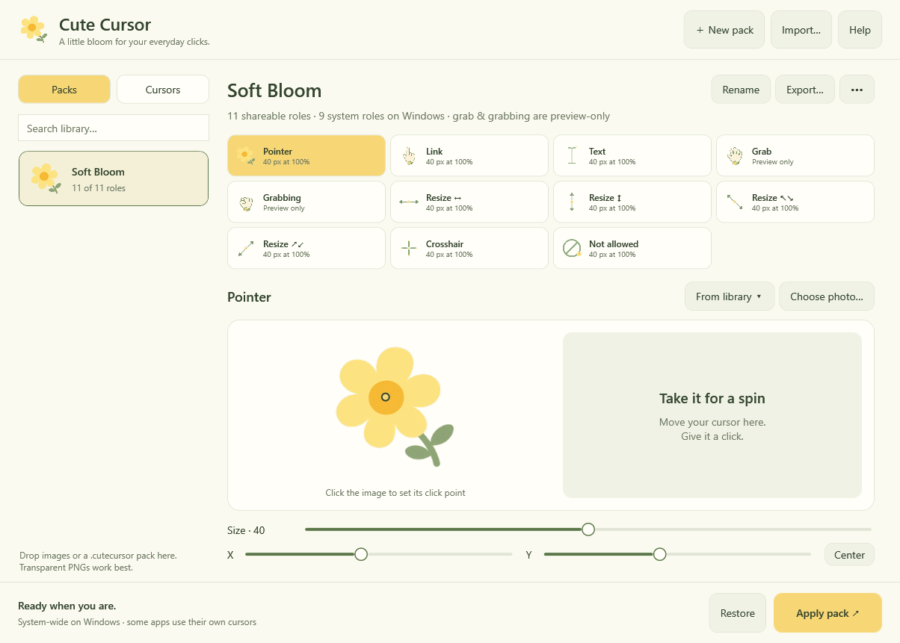

# Cute Cursor for Windows — source preview

The Windows implementation lives on `codex/windows`, separately from the Mac
checkpoint on `codex/mac-beta`. It is a native WPF desktop app using .NET 10 and
documented Win32 cursor APIs. It shares the original artwork and version 1 pack
format with the Mac app. No third-party runtime packages, accounts, administrator
rights, or network connection are needed by the app.

This is development source, not a signed public release. The initial target is
Windows 11, x64 and ARM64. Actual system-wide behavior and accessibility still
require hands-on Windows testing; a successful build is not that verification.



*Rendered from the native WPF app on the Windows CI runner.*

## Implementation plan and status

1. **Shared data — implemented.** Portable pack validation, independent library
   and pack edits, atomic library saves, migration receipt for Soft Bloom, and
   import/export compatible with the two Mac examples.
2. **Native editor — implemented.** Yellow/sage/cream interface, unboxed flower
   logo, searchable Packs/Cursors library, favorites, role grid, image preview,
   click-point controls, sizes, pack naming, themed menus and confirmations.
3. **Windows integration — implemented.** Nine system cursor roles, preflight,
   rollback, retained originals, partial-pack restoration, tray lifecycle and
   recovery after an interrupted session. No cursor registry modifications.
4. **Automation and packaging — implemented.** Portable tests, Windows-native
   image/cursor creation checks, isolated UI rendering, self-contained x64/ARM64
   ZIP packaging. CI does not apply system cursors or publish installers.
5. **Hands-on verification — pending.** Run the matrix below on Windows before
   treating this as a beta suitable for other people's machines.
6. **Public distribution — deferred.** Authenticode signing, an installer if
   desired, downloaded-file checks, and GitHub Release assets come later.

## Build and run

Install the [.NET 10 SDK](https://dotnet.microsoft.com/download/dotnet/10.0) on
Windows, then in PowerShell:

```powershell
git clone --branch codex/windows https://github.com/vigneshkae/cute-cursor.git
cd cute-cursor
dotnet run --project Windows/CuteCursor.Tests
dotnet run --project Windows/CuteCursor.Windows
```

To create local portable development packages:

```powershell
./scripts/build-windows.ps1 -Runtime win-x64
./scripts/build-windows.ps1 -Runtime win-arm64
```

Extract the ZIP and open `CuteCursor.exe`. The runtime is bundled, so the packaged
app does not require a separate .NET installation. WPF native libraries may be
extracted by .NET at launch. These EXEs are unsigned development builds and may
trigger Windows reputation warnings. Neither packages nor final builds are
uploaded by the workflow. Only a temporary UI review image is uploaded to Actions.

The portable core tests also run on macOS with the .NET 10 SDK. The WPF project
can be cross-compiled there, but running it requires Windows.

## Features and platform differences

- Soft Bloom is installed once, with all 11 roles at **size 40**. User renames,
  changed sizes, images and intentional deletions survive relaunch.
- Size is the longest side in logical units: 40 becomes 40 pixels at 100% display
  scale, 60 at 150%, and 80 at 200%. Apply uses the editor window's current scale.
  Windows holds one replacement per role; per-monitor sizing after moving to a
  different display still needs verification. Reapply on the intended display.
- Nine shared roles map to `SetSystemCursor`: pointer, link, text, crosshair,
  prohibited, and four resize directions. **Grab and Grabbing are preview-only**
  on Windows because Win32 has no corresponding global system slots. They remain
  editable and are retained when sharing a pack with a Mac.
- PNG, JPEG, GIF, BMP, TIFF and ICO are accepted through Windows image decoding.
  Transparent PNGs work best. Multi-frame images use the first frame. ANI, SVG,
  CUR, WebP and HEIC are not offered as supported Windows import formats.
- Images are limited to 16 MB, 16,384 pixels per side and 64 megapixels. They are
  stored as PNG at up to 256 × 256. Fully transparent images are rejected.
- Menus and dialogs within the editor follow the app palette. File pickers and
  window chrome are native Windows UI. Pack opening uses Import or drag and drop;
  file associations are deliberately deferred until installer work.
- Some apps use custom cursor handles or render their own cursors. Those cannot
  be replaced through the standard global cursor roles.
- Editing does not silently reapply. Click Apply again to use changed settings.
  A pointer-only selection restores other mapped roles to the captured originals.
- Closing the window keeps the app running in the system tray. Tray **Exit**
  restores the originals; **Restore** is also available in the fixed action bar.
  A second instance is prevented within the same Windows session.

## Recovery and storage

The library lives at `%LOCALAPPDATA%\CuteCursor\library.json`. Export packs before
moving to another machine. Original image files are never changed. A corrupt
library causes startup to fail visibly while preserving the file; it is not
silently reset. There is a 128 MB library limit.

Before the first native mutation the app writes `active-session.txt` in the same
folder. Original cursor handles stay in memory until a complete Restore succeeds.
If application or rollback fails, the app retains those handles for another
Restore attempt. It tries every role even when one restoration fails.

After a crash, the handles are gone. On next launch the app offers to reload your
**configured Windows cursor scheme** using `SPI_SETCURSORS`. It cannot reconstruct
another application's temporary custom cursors from the previous process. Restore
must complete before applying another pack. Signing out and back in also resets
session cursor changes. No startup auto-apply or permanent scheme installation is
implemented.

## Checks

```powershell
dotnet run --project Windows/CuteCursor.Tests -c Release
dotnet build Windows/CuteCursor.Windows -c Release
$env:CUTE_CURSOR_SMOKE_RESULT = "$env:TEMP/cute-cursor-smoke.json"
dotnet Windows/CuteCursor.Windows/bin/Release/net10.0-windows/CuteCursor.dll --self-test
Get-Content $env:CUTE_CURSOR_SMOKE_RESULT
```

The 27-test portable suite covers pack round trips and rejection, geometry, persisted
favorites, independent edits, deleted defaults, corrupt storage, preflight,
partial packs, apply rollback and restoration retries. A fake backend tracks
handle ownership and asserts that none leak after successful restoration.

The native smoke check decodes the complete bundled pack, creates 44 cursor
handles across four scale factors, verifies their native hotspots, and captures
nine original handles. It also verifies five image import formats, size/aspect
preservation, and rejection of transparent or corrupt images. It **never calls
SetSystemCursor**. CI repeats it on the published x64 executable. The Windows workflow
also renders the real WPF window with an isolated temporary library and builds
both architecture packages without distributing them.

## Manual Windows acceptance matrix

Run on an interactive Windows 11 x64 machine and a native ARM64 machine:

- Fresh launch: Soft Bloom, all 11 slots at 40, readable controls at 100%, 150%,
  and 200% display scaling, minimum window size, keyboard navigation and screen reader.
- Import transparent PNG and opaque JPEG; verify first-frame GIF behavior, corrupt
  image rejection, and mixed successful/failed multi-file imports.
- Create and rename a pack, assign from library, edit size/click point, clear a
  role, favorite an image, remove/cancel, export/import, and relaunch.
- Export from Windows and import on Mac, and vice versa, comparing every role,
  image, size and normalized hotspot. Automated tests currently read Mac examples.
- Apply Soft Bloom; inspect pointer, links, text, four resize directions,
  crosshair and prohibited cursor in Explorer, Edge and native apps that use those
  roles. Verify the click point precisely. Note applications that use their own.
- Switch to pointer-only and confirm omitted roles restore. Restore then compare
  with the user's preexisting Windows scheme, including custom accessibility size.
- Close to tray, reopen, launch a second instance, exit, and log off. Check Restore
  failures are visible and keep retry state. Never force an actual failure in a
  user's session just to exercise a test; that path is covered by the fake backend.
- In a disposable test account, force-close with a pack active, relaunch and test
  crash recovery. Verify the user's configured scheme is reloaded.
- Change display scaling/move between monitors, lock/unlock, sleep/wake, switch
  themes, and check app-specific cursor overrides. Reapply as needed; document limits.
- Extract each development ZIP on a clean matching-architecture Windows machine
  with no .NET SDK/runtime installed, then launch, edit, apply, restore and exit.

## Native API references

- [SetSystemCursor and the supported role IDs](https://learn.microsoft.com/en-us/windows/win32/api/winuser/nf-winuser-setsystemcursor)
- [CopyImage ownership](https://learn.microsoft.com/en-us/windows/win32/api/winuser/nf-winuser-copyimage)
- [CreateIconIndirect](https://learn.microsoft.com/en-us/windows/win32/api/winuser/nf-winuser-createiconindirect)
- [.NET single-file deployment](https://learn.microsoft.com/en-us/dotnet/core/deploying/single-file/overview)
