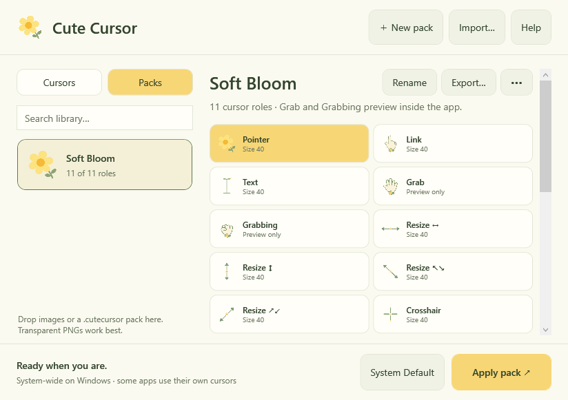

# Windows 0.3.2 beta validation

Build source: `2fec31c014188f861906f337466f81c448f40301` on `codex/windows`.
[Windows runner and packaged artifacts](https://github.com/vigneshkae/cute-cursor/actions/runs/35991802937).

## Passed on September 24, 2026

- 34 portable tests: collection seeding/upgrades, preservation of edits and deletions,
  image/pack validation, transactional apply/rollback, and retryable default restoration.
- Native Windows build with no warnings or errors.
- All 20 collection images and 11 pack images decoded and created as native cursors:
  124 variants across 100%, 125%, 150%, and 200% scaling; native hotspots checked.
- Five image import formats; transparent/truncated image rejection; pack round trip.
- Isolated UI assertions: 20 options, size 40, all 11 pack roles, and System Default
  clearing custom selection and preview while disabling Apply.
- The packaged self-contained x64 executable ran the native smoke tests successfully.
- Both x64 and ARM64 executable architecture headers validated during packaging.
- Mac CI also passed for the same source commit; no Mac package was released from it.

## Visual review

Reviewed native Windows renders of the collection, pack, and System Default screens
at 1220 × 900 outer window size and the pack at 840 × 620. Role cards now adapt from
four to two columns, with readable names and a fixed, accessible action bar.
The current Segoe UI wordmark is retained; no replacement font is bundled.

## Remaining hands-on checks

Automated tests never call SetSystemCursor or modify the live Windows scheme.
System-wide Apply/Restore, tray lifecycle, app-specific cursor overrides, mixed-DPI
monitor movement, and accessibility cursor settings still need interactive testing.
ARM64 was cross-published, not executed on Windows ARM hardware. Grab/Grabbing remain
preview-only. These downloads are unsigned testing ZIPs, not signed final installers.
See the [test checklist](TESTING_DOWNLOADS.md).

## Package integrity

Downloaded the CI artifacts and verified ZIP integrity, the three expected files,
PE architecture, and each adjacent checksum. Release ZIP SHA-256 values:

- `Cute-Cursor-Windows-ARM64.zip`: `26ce32ea063e49a03c95c38ff2b03b9fe9b0c62c3cc12179a47601875ceb9260`
- `Cute-Cursor-Windows-x64.zip`: `9365fecdc937032691212c408073df46ab43332a620e7871f5404e513947eb32`
